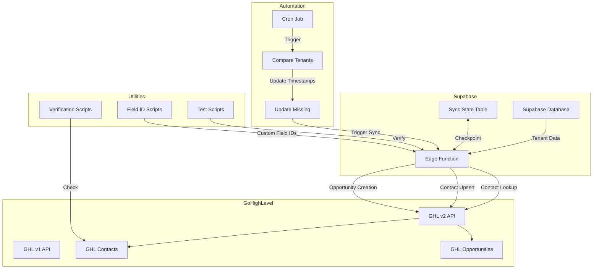
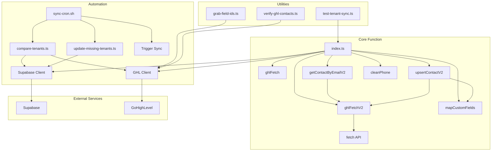
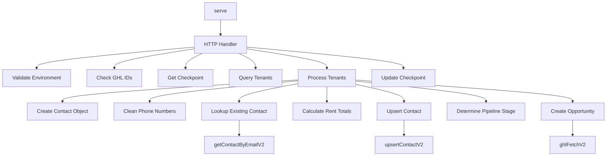
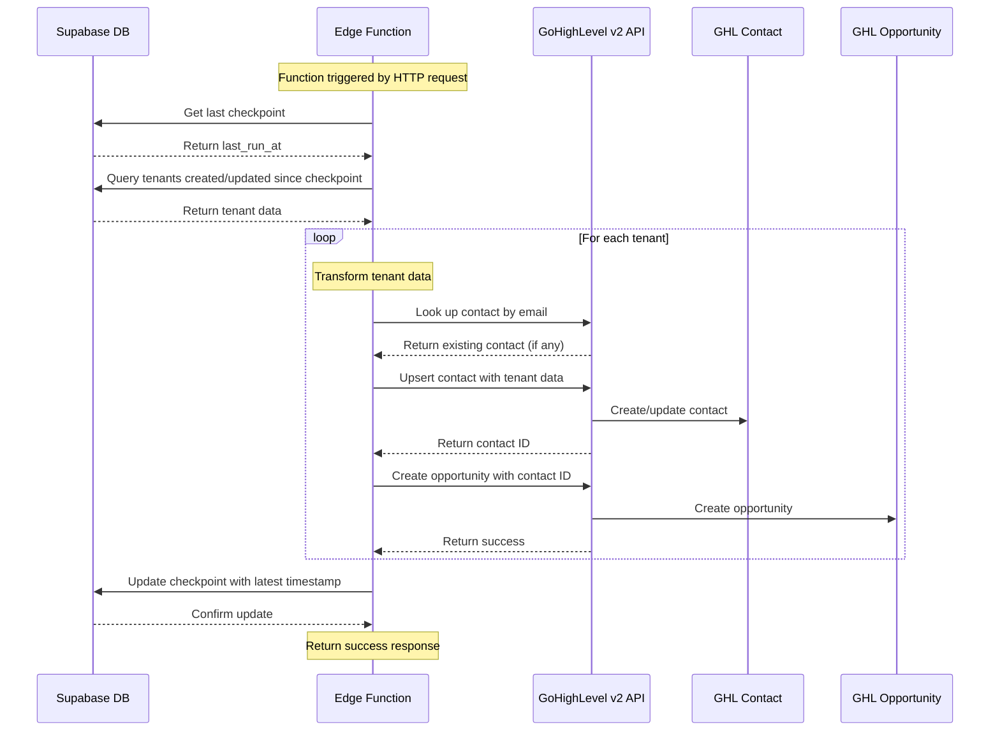

# Supabase → GoHighLevel Sync Architecture Overview

## Executive Summary

This document provides a comprehensive overview of the Supabase → GoHighLevel sync project, which synchronizes tenant data from a Supabase database to GoHighLevel (GHL) contacts and opportunities. The system is built as a Supabase Edge Function that processes tenant records, transforms them into the appropriate format, and creates or updates contacts and opportunities in GoHighLevel.

The project addresses several key challenges:
- Proper handling of phone number formatting
- Management of custom fields in GoHighLevel
- Race conditions with duplicate contacts
- Grouping multiple rental rows into a single contact
- Migration from GHL API v1 to v2

This document outlines the architecture, data flow, key components, identified issues, and recommended solutions for the sync system.

## Project Overview

### Purpose

The primary purpose of this project is to synchronize tenant data stored in a Supabase database to GoHighLevel, a CRM platform. This synchronization enables:

- Creation and updating of contacts in GoHighLevel based on tenant data
- Creation of opportunities in GoHighLevel with appropriate pipeline stages
- Tracking of rental history and total rent values
- Assignment of contacts to appropriate users

### Core Functionality

1. **Tenant Data Synchronization**: Retrieves tenant data from Supabase that has been created or updated since the last sync
2. **Contact Management**: Creates or updates contacts in GoHighLevel with tenant information
3. **Opportunity Creation**: Creates opportunities in GoHighLevel linked to contacts with appropriate pipeline stages
4. **Checkpoint Management**: Tracks the last successful sync to avoid reprocessing the same data
5. **Error Handling**: Gracefully handles errors during processing to ensure the sync process continues

### Technology Stack

- **Supabase**: PostgreSQL database and serverless functions platform
- **Deno**: JavaScript/TypeScript runtime for the Edge Function
- **GoHighLevel API**: CRM platform API (both v1 and v2) for contact and opportunity management
- **Cron Jobs**: For automated regular synchronization

## System Architecture

### High-Level Architecture Diagram



### Component Interactions

The system consists of several interacting components:

1. **Supabase Edge Function**: The core component that handles the synchronization logic
2. **Supabase Database**: Stores tenant data and sync state
3. **GoHighLevel API**: External CRM system where contacts and opportunities are created
4. **Automation Scripts**: Cron jobs and comparison tools for regular synchronization
5. **Utility Scripts**: Tools for testing, verification, and configuration

### External Service Integrations

The system integrates with two main external services:

1. **Supabase**:
   - Used as the primary database for tenant data
   - Hosts the Edge Function
   - Provides service role access for database operations

2. **GoHighLevel (GHL)**:
   - CRM system where contacts and opportunities are created
   - Uses both v1 and v2 APIs with different authentication methods
   - Requires specific formatting for custom fields and phone numbers

## Core Components

### Supabase Edge Function

The core of the system is the Supabase Edge Function (`sync_leases-ts/index.ts`), which:

- Runs in the Supabase serverless environment
- Has access to the Supabase database via service role
- Makes API calls to GoHighLevel
- Handles data transformation and synchronization logic

Key functions within the Edge Function:

- `ghlFetch`: Wrapper for GHL v1 API calls
- `ghlFetchV2`: Wrapper for GHL v2 API calls
- `getContactByEmailV2`: Looks up contacts by email using the v2 API
- `upsertContactV2`: Creates or updates contacts using the v2 API
- `mapCustomFields`: Converts customFields from object to array format

### Tenant Data Structure

The tenant data in Supabase includes:

```javascript
{
  id: 4576,
  lease_date: "2025-07-15",
  check_in_date: "2026-07-18",
  check_out_date: "2026-07-25",
  tenant_name: "Evan Kasowitz",
  tenant_address: "9 Skyline Drive Malvern PA",
  tenant_phone: ["2036718335"],
  tenant_email: "evan.kasowitz@gmail.com",
  rental_address: "4806 West Ave, 2nd/#2",
  unit_number: "460b",
  unit_owner: "Stoneview Properties LLC",
  rent: "0.0",
  status: "Canceled",
  confirmation_number: "BGZHNRRURTUI",
  last_scraped_at: "2025-07-24 18:17:43.854509+00",
  created_at: "2025-07-24 22:17:43.944204+00",
  first_name: "Evan",
  last_name: "Kasowitz",
  user_id: "dc7b6ab0-632a-401a-8f00-a47c0a179b48"
}
```

### GoHighLevel Integration

The integration with GoHighLevel involves:

- Contact creation/update with proper phone formatting
- Custom field mapping for tenant-specific data
- Opportunity creation with appropriate pipeline stage
- Proper handling of API versions (v1 vs v2)

### Checkpoint Management

The system uses a checkpoint mechanism to track the last successful sync:

- Stores the last run timestamp in the `sync_state` table
- Uses this timestamp to only process tenants created or updated since the last run
- Updates the checkpoint after successful processing

### Error Handling and Logging

The system includes comprehensive error handling:

- Try/catch blocks around critical operations
- Detailed logging of errors and processing status
- Continuation of processing despite individual tenant errors
- Checkpoint updates even when no tenants are processed

## Data Flow

### Tenant Data Retrieval

1. The function retrieves the last run timestamp from the `sync_state` table
2. It queries tenants from Supabase that were created or updated since the last checkpoint
3. For each tenant, it creates a contact object with tenant data

### Data Transformation

1. Tenant data is transformed into a GHL contact format
2. Phone numbers are cleaned and formatted
3. Custom fields are mapped to GHL custom field IDs
4. Yearly rent totals are calculated and stored as custom fields

### Contact Creation/Update

1. The function searches for existing contacts in GHL by email using the v2 API
2. It formats the contact data with proper custom fields
3. It upserts the contact to GHL using the v2 API

### Opportunity Creation

1. The function determines the appropriate pipeline stage based on tenant data
2. It creates or updates an opportunity in GHL linked to the contact
3. It sets the monetary value based on the tenant's rent

### Checkpoint Update

1. After processing all tenants, the function updates the checkpoint in the `sync_state` table
2. It uses the latest timestamp from processed tenants to avoid reprocessing
3. It updates the checkpoint even when no tenants are processed to prevent reprocessing the same time range

## Environment & Configuration

### Critical Environment Variables

```
SUPABASE_URL
SUPABASE_SERVICE_ROLE_KEY
GHL_API_KEY
GHL_API_V2_KEY
GHL_PIPELINE_ID
```

### GHL Pipeline and Stage IDs

```
STAGE_NEW_INQUIRY_ID
STAGE_NEEDS_SEARCH_ID
STAGE_SEARCH_SENT_ID
STAGE_BOOKED_2025_ID
STAGE_BOOKED_2026_ID
STAGE_PAST_GUEST_ID
```

### Custom Field IDs

```
CF_SUPABASE_TENANT_ID
CF_CURRENT_RENTAL_ADDRESS
CF_CURRENT_UNIT_NUMBER
CF_CURRENT_OWNER_NAME
CF_CURRENT_OWNER_PHONES_JSON
CF_SECONDARY_PHONE
CF_YEARLY_RENT_TOTALS_JSON
CF_TOTAL_LIFETIME_RENT
```

### User Mappings

```
SUPA_BRANDON_UUID
GHL_BRANDON_USER_ID
SUPA_CASSIDY_UUID
GHL_CASSIDY_USER_ID
```

## Automation & Monitoring

### Cron Job Setup

The system includes a cron job (`sync-cron.sh`) that:

- Runs every 6 hours
- Compares tenants in Supabase with contacts in GoHighLevel
- Updates the `last_scraped_at` timestamp for missing tenants
- Triggers the sync function to process the updated tenants

### Comparison Tools

The system includes comparison tools (`compare-tenants.ts`) that:

- Query tenants from Supabase
- Query contacts from GoHighLevel
- Identify tenants missing in GoHighLevel
- Generate a report of missing tenants

### Verification Tools

The system includes verification tools (`verify-ghl-contacts.ts`) that:

- Check if specific contacts exist in GoHighLevel by email address
- Verify that contacts have been successfully created
- Check that custom fields are correctly populated

### Logging and Error Handling

The system includes extensive logging:

- Request/response logging for all API calls
- Detailed error messages
- Processing status for each tenant
- Checkpoint update logging

## Identified Issues & Solutions

### 1. customFields Object vs Array Issue

**Issue**: The GoHighLevel API expects `customFields` to be an array of objects with `id` and `value` properties, but sometimes it becomes an object.

**Solution**: 
- Added a helper function `mapCustomFields` to convert customFields from object to array format
- Added validation to ensure customFields is always an array before sending to the API
- Added defensive programming to handle both formats

```javascript
// Helper function to map customFields from object to array
function mapCustomFields(customFields) {
  console.log("🔥 NEW mapper hit - converting customFields from object to array");
  return Object.entries(customFields || {}).map(([id, value]) => ({ id, value }));
}

// In upsertContactV2
const body = {
  ...contactData,
  locationId: LOCATION_ID,
  customFields: Array.isArray(contactData.customFields) 
    ? contactData.customFields 
    : mapCustomFields(contactData.customFields)
};
```

### 2. Race Conditions with Duplicate Contacts

**Issue**: When two tenant rows sync simultaneously, race conditions can occur, leading to duplicate contacts.

**Solution**:
- Use the v2 API's contact lookup by email before creating new contacts
- Process tenants sequentially rather than in parallel
- Add error handling to continue processing despite individual failures
- Use proper error handling to avoid partial updates

```javascript
// Use v2 API to look up contact
console.log(`Searching for existing contact with email ${r.tenant_email}`);
existing = await getContactByEmailV2(r.tenant_email);
console.log(`Found existing contact: ${existing ? 'yes' : 'no'}`);
```

### 3. Phone Number Formatting Problems

**Issue**: Phone numbers with multiple values (e.g., "8567805758 / 6097744077") were being concatenated into a single string.

**Solution**:
- Updated the function to properly handle multiple phone numbers separated by slashes
- Use the first number as the primary phone
- Store additional numbers in a custom field
- Format phone numbers correctly with international format

```javascript
// Handle phone numbers properly - tenant_phone can be an array of phone numbers
if (r.tenant_phone && Array.isArray(r.tenant_phone) && r.tenant_phone.length > 0) {
  // Process the first phone number for the primary phone field
  const firstPhone = r.tenant_phone[0];
  console.log(`Processing first phone number: ${firstPhone}`);
  
  const cleanedPhone = cleanPhone(firstPhone);
  if (cleanedPhone && cleanedPhone.length >= 10 && cleanedPhone.length <= 15 && !cleanedPhone.startsWith('0')) {
    // Format the phone number with international format
    contact.phone = `+${cleanedPhone}`;
    console.log(`Using cleaned phone: ${contact.phone}`);
  }
  
  // Process the second phone number if available
  if (r.tenant_phone.length > 1) {
    const secondPhone = r.tenant_phone[1];
    console.log(`Processing second phone number: ${secondPhone}`);
    
    const cleanedSecondPhone = cleanPhone(secondPhone);
    if (cleanedSecondPhone && cleanedSecondPhone.length >= 10 && cleanedSecondPhone.length <= 15 && !cleanedSecondPhone.startsWith('0')) {
      // Get the custom field ID for secondary phone
      const cfSecondaryPhoneId = Deno.env.get("CF_SECONDARY_PHONE");
      if (cfSecondaryPhoneId) {
        contact.customField.push({
          id: cfSecondaryPhoneId,
          value: `+${cleanedSecondPhone}`
        });
        console.log(`Added second phone as custom field: +${cleanedSecondPhone}`);
      }
    }
  }
}
```

### 4. Rental History Grouping Strategy

**Issue**: Multiple rental rows for the same tenant need to be grouped into one contact while maintaining separate rental history.

**Solution**:
- Use custom fields to store yearly rent totals as JSON
- Calculate total lifetime rent across all rentals
- Update the yearly rent totals when processing new rentals
- Maintain separate contact records for different rental histories

```javascript
// Safe JSON parsing
let totals = {};
try {
  if (existing?.customField?.yearly_rent_totals_json) {
    totals = JSON.parse(existing.customField.yearly_rent_totals_json);
    console.log(`Parsed existing yearly_rent_totals_json: ${JSON.stringify(totals)}`);
  }
} catch (error) {
  console.error(`Error parsing yearly_rent_totals_json: ${error.message}`);
}

totals[year] = (totals[year] ?? 0) + rent;

// Calculate the total lifetime rent
const totalLifetimeRent = Object.values(totals).reduce((a, b) => a + Number(b), 0);

// Add yearly rent totals as a custom field
const yearlyRentTotalsId = Deno.env.get("CF_YEARLY_RENT_TOTALS_JSON");
if (yearlyRentTotalsId) {
  contact.customField.push({
    id: yearlyRentTotalsId,
    value: JSON.stringify(totals)
  });
}

// Add total lifetime rent as a custom field
const totalLifetimeRentId = Deno.env.get("CF_TOTAL_LIFETIME_RENT");
if (totalLifetimeRentId) {
  contact.customField.push({
    id: totalLifetimeRentId,
    value: String(totalLifetimeRent)
  });
}
```

### 5. GHL API v1 to v2 Migration

**Issue**: The project needs to migrate from GHL API v1 to v2 for opportunities.

**Solution**:
- Created wrapper functions for both v1 and v2 API calls
- Updated contact lookup to use v2 API
- Updated contact upsert to use v2 API
- Updated opportunity creation to use v2 API
- Added proper error handling for both API versions

```javascript
// wrapper for GHL v2 API calls
const ghlFetchV2 = async (url, opts) => {
  // Create headers with Authorization and Version
  const headers = {
    Authorization: `Bearer ${GHL.KEY_V2}`,
    "Content-Type": "application/json",
    Version: "2021-07-28", // Recommended for API stability
    ...(opts.headers || {})
  };
  
  // For GET requests with query parameters
  if (opts.method === "GET" && !url.includes("locationId=")) {
    // Add locationId as query parameter if not already present
    const separator = url.includes("?") ? "&" : "?";
    url = `${url}${separator}locationId=${LOCATION_ID}`;
  }
  
  // For POST requests, ensure locationId is in the body
  if (opts.method === "POST" && opts.body) {
    let body;
    try {
      body = JSON.parse(opts.body);
      if (!body.locationId) {
        body.locationId = LOCATION_ID;
        opts.body = JSON.stringify(body);
      }
    } catch (e) {
      console.error("Error parsing request body:", e);
    }
  }
  
  const res = await fetch(url, {
    ...opts,
    headers
  });
  
  if (!res.ok) {
    const errorText = await res.text();
    console.error(`GHL v2 ${url} failed ${res.status}`, errorText);
    throw new Error(`GHL v2 ${url} ${res.status}`);
  }
  
  return res;
};
```

## Dependency Graph

### Module Interactions



### Function Dependencies



### Data Flow Visualization



## Testing & Deployment

### Local Testing Procedures

1. Set up local environment variables:
   ```bash
   ./setup-local-env.sh
   ```

2. Serve the function locally:
   ```bash
   supabase functions serve sync_leases-ts --env-file ./supabase/.env.local
   ```

3. Test with curl or Postman:
   ```bash
   curl -X POST "http://localhost:54321/functions/v1/sync_leases-ts" \
     -H "Content-Type: application/json" \
     -d '{}'
   ```

4. Use the test script:
   ```bash
   ./test-function.sh
   ```

### Deployment Process

1. Deploy the function:
   ```bash
   supabase functions deploy sync_leases-ts --project-ref bcuwccyyjgmshslnkpyv
   ```

2. Set required secrets:
   ```bash
   supabase secrets set \
     CF_SUPABASE_TENANT_ID=your_field_id \
     CF_CURRENT_RENTAL_ADDRESS=your_field_id \
     --project-ref bcuwccyyjgmshslnkpyv
   ```

3. Test the deployed function:
   ```bash
   curl -X POST \
     "https://bcuwccyyjgmshslnkpyv.functions.supabase.co/sync_leases-ts" \
     -H "Authorization: Bearer $SUPABASE_SERVICE_ROLE_KEY" \
     -H "Content-Type: application/json" \
     -d '{}'
   ```

### Monitoring and Verification

1. Check logs in Supabase Studio:
   - Go to Supabase Studio → Edge Functions → sync_leases-ts → Logs

2. Verify checkpoint update:
   ```sql
   select last_run_at
   from sync_state
   where id = 'ghl_lease_sync';
   ```

3. Check for successful tenant processing:
   ```sql
   select *
   from tenants
   order by greatest(created_at, last_scraped_at) desc
   limit 12;
   ```

## Recommendations & Future Work

### 1. Performance Optimizations

- Implement batch processing for large tenant datasets
- Add rate limiting for GHL API calls to avoid throttling
- Consider caching frequently accessed data

### 2. Error Handling Improvements

- Implement retry logic for failed API calls
- Add more granular error categorization
- Create a dedicated error logging system

### 3. Monitoring Enhancements

- Set up alerts for function failures
- Create a dashboard for sync status
- Implement metrics collection for performance analysis

### 4. API Migration Completion

- Complete the migration from GHL API v1 to v2
- Update all remaining v1 API calls to use v2
- Implement OAuth authentication for v2 API

### 5. Contact Management Strategy

- Develop a more robust strategy for handling duplicate contacts
- Implement a contact merging mechanism
- Create a unified view of rental history across multiple contacts

## Conclusion

The Supabase → GoHighLevel sync project provides a robust solution for synchronizing tenant data to a CRM system. The architecture is designed to handle various edge cases, provide proper error handling, and ensure data integrity. By addressing the identified issues and implementing the recommended solutions, the system can be further improved to provide even more reliable and efficient synchronization.