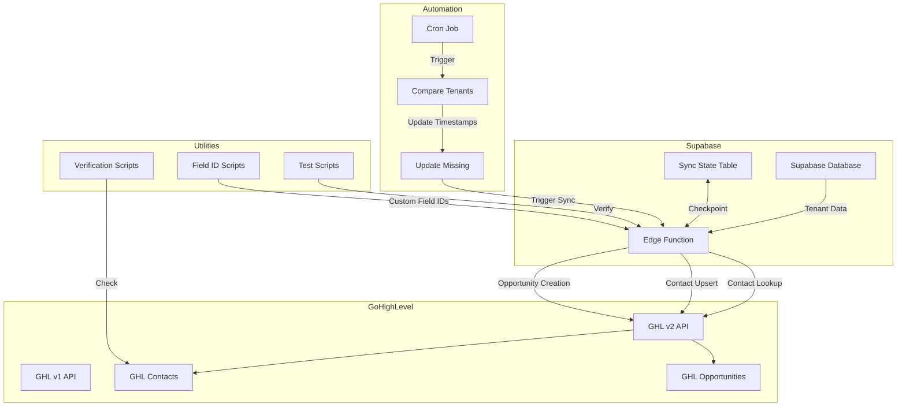
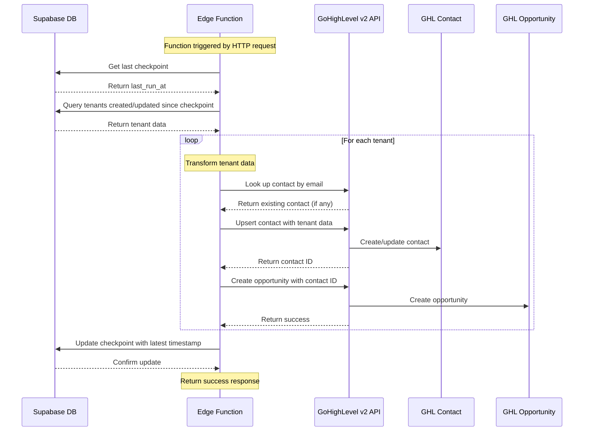
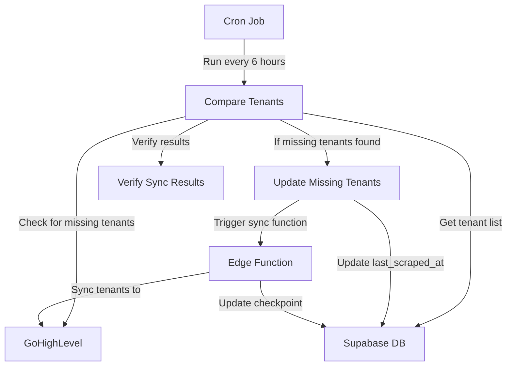

# Supabase → GoHighLevel Sync Architecture

## 1. File/Folder Inventory

### Core Files

- **supabase/functions/sync_leases-ts/index.ts**: Main Supabase Edge Function that syncs tenant data from Supabase to GoHighLevel contacts and opportunities.
- **test-tenant-sync.ts**: Test script to verify phone number formatting and contact creation for a specific tenant.
- **compare-tenants.ts**: Script to compare tenants in Supabase with contacts in GoHighLevel to identify missing contacts.
- **update-missing-tenants.ts**: Script to update the `last_scraped_at` timestamp for tenants missing in GoHighLevel to trigger sync.
- **verify-ghl-contacts.ts**: Script to check if specific contacts exist in GoHighLevel by email address.

### Utility Scripts

- **sync-cron.sh**: Cron job script to automate tenant synchronization by checking for missing tenants and triggering the sync function.
- **grab-field-ids.ts**: Script to extract GoHighLevel custom field IDs needed for the sync function.
- **grab-field-ids-extended.ts**: Enhanced version of the field ID extraction script with additional fields.
- **grab-field-ids-extended.js**: JavaScript version of the extended field ID extraction script.
- **check-ghl-contacts.sh**: Shell script to check for contacts in GoHighLevel.
- **extract-field-ids.sh**: Shell script wrapper for the field ID extraction process.
- **setup-local-env.sh**: Script to set up the local environment for testing.
- **test-function.sh**: Script to test the sync function locally or in production.
- **deploy.sh**: Script to deploy the Supabase Edge Function.
- **update-supabase-secrets.sh**: Script to update Supabase secrets/environment variables.

### Phone Number Handling

- **check-phone-formatting.ts**: Script to check phone number formatting in the database.
- **fix-phone-formatting.ts**: Script to fix phone number formatting issues.
- **direct-check-ghl-phones.ts**: Script to directly check phone numbers in GoHighLevel.
- **direct-fix-phone-formatting.ts**: Script to directly fix phone formatting in GoHighLevel.
- **fix-specific-contact.ts**: Script to fix a specific contact's phone number.
- **add-note-to-contact.ts**: Script to add a note to a contact in GoHighLevel.
- **update-contact-custom-field.ts**: Script to update a custom field for a contact.
- **update-contact-name.ts**: Script to update a contact's name.
- **create-secondary-phone-field.ts**: Script to create a secondary phone field for contacts.

### Documentation

- **README.md**: Main project documentation with deployment and testing instructions.
- **FIELD-IDS-README.md**: Documentation for the field ID extraction process.
- **EXTENDED-FIELD-IDS-README.md**: Documentation for the extended field ID extraction.
- **COMPARE-README.md**: Documentation for the tenant comparison process.
- **UPDATE-README.md**: Documentation for updating missing tenants.
- **VERIFY-README.md**: Documentation for verifying GHL contacts.
- **CRON-README.md**: Documentation for the cron job setup.
- **ENVIRONMENT-VARIABLES-README.md**: Documentation for environment variables.
- **PHONE-FORMAT-CHECK-README.md**: Documentation for phone format checking.
- **API_MIGRATION_TEST_PLAN.md**: Test plan for API migration.
- **API_FIX_TEST_PLAN.md**: Test plan for API fixes.
- **sync_leases_analysis.md**: Analysis of the sync process.
- **ghl-debug-snapshot.md**: Debug snapshot of GoHighLevel data.
- **phone-number-sync-summary.md**: Summary of phone number sync issues.

### Configuration Files

- **.env**: Environment variables for local development.
- **supabase/.env.local**: Local environment variables for Supabase.
- **supabase/.env.local.template**: Template for local Supabase environment variables.
- **deno.jsonc**: Deno configuration file.
- **deno.lock**: Deno lock file for dependencies.
- **import_map.json**: Import map for Deno modules.

### Database Files

- **insert_test_tenant.sql**: SQL script to insert a test tenant into the database.
- **query-specific-contacts.sql**: SQL script to query specific contacts.

### Data Files

- **formatting-issues.json**: JSON file containing phone formatting issues.
- **ghl-formatting-issues.json**: JSON file containing GHL phone formatting issues.
- **priority-fixes.json**: JSON file containing priority fixes for phone numbers.
- **test_contacts.md**: List of test contacts for verification.

## 2. Execution Flow

The main execution flow starts from the Supabase Edge Function at `supabase/functions/sync_leases-ts/index.ts` and follows these steps:

1. **Function Initialization**:
   - Validates critical environment variables (SUPABASE_URL, SUPABASE_SERVICE_ROLE_KEY, GHL_API_KEY, GHL_PIPELINE_ID)
   - Creates a Supabase client with service role permissions
   - Sets up GHL constants including location ID, API keys, and pipeline stages

2. **HTTP Request Handling**:
   - The function is triggered by an HTTP request to the Supabase Edge Function endpoint
   - Validates GHL IDs for pipeline and stages

3. **Checkpoint Management**:
   - Retrieves the last run timestamp from the `sync_state` table
   - Uses this timestamp to only process tenants created or updated since the last run

4. **Tenant Processing**:
   - Queries tenants from Supabase that were created or updated since the last checkpoint
   - For each tenant, creates a contact object with tenant data

5. **Contact Creation/Update in GoHighLevel**:
   - Searches for existing contact in GHL by email using the v2 API
   - Formats phone numbers properly
   - Maps custom fields from Supabase tenant data
   - Upserts the contact to GHL using the v2 API

6. **Opportunity Creation in GoHighLevel**:
   - Determines the appropriate pipeline stage based on tenant data
   - Creates or updates an opportunity in GHL linked to the contact
   - Sets the monetary value based on the tenant's rent

7. **Checkpoint Update**:
   - After processing all tenants, updates the checkpoint in the `sync_state` table
   - Uses the latest timestamp from processed tenants to avoid reprocessing

## 3. Data Path for a Single Tenant Row

For a single tenant row, the data flows as follows:

1. **Data Source**: 
   - Tenant data is stored in the `tenants` table in Supabase
   - Each tenant has fields like id, first_name, last_name, tenant_email, tenant_phone, etc.

2. **Trigger**:
   - The sync process is triggered either manually or via the cron job
   - The function checks for tenants created or updated since the last run

3. **Data Transformation**:
   - Tenant data is transformed into a GHL contact format
   - Phone numbers are cleaned and formatted
   - Custom fields are mapped to GHL custom field IDs

4. **API Calls**:
   - The function makes API calls to GoHighLevel:
     - First checks if the contact exists using the v2 API
     - Creates or updates the contact with tenant data
     - Creates or updates an opportunity linked to the contact

5. **Verification**:
   - The sync process tracks successfully processed tenants
   - Updates the checkpoint to avoid reprocessing the same tenants

6. **Error Handling**:
   - Errors during processing are logged but don't stop the entire sync
   - The function continues to the next tenant if there's an error with the current one

## 4. External Services Integration

The system integrates with two main external services:

1. **Supabase**:
   - Used as the primary database for tenant data
   - The Edge Function runs on Supabase infrastructure
   - Uses Supabase service role for database access

2. **GoHighLevel (GHL)**:
   - CRM system where contacts and opportunities are created
   - Uses both v1 and v2 APIs:
     - v1 API for some operations with location-specific headers
     - v2 API for contact lookup and upsert with different authentication

## 5. Architecture Diagrams

### System Architecture Diagram

### Data Flow Diagram for a Single Tenant

### Cron Job Automation Flow

## 6. Key Components and Their Roles

### Supabase Edge Function (sync_leases-ts/index.ts)

The core of the system is the Supabase Edge Function, which:
- Runs in the Supabase serverless environment
- Has access to the Supabase database via service role
- Makes API calls to GoHighLevel
- Handles data transformation and synchronization logic

### Tenant Data Structure

The tenant data in Supabase includes:
- Basic information (name, email, phone)
- Rental details (address, unit number, rent amount)
- Dates (check-in date, created_at, last_scraped_at)
- Owner information (owner name, owner phone)

### GoHighLevel Integration

The integration with GoHighLevel involves:
- Contact creation/update with proper phone formatting
- Custom field mapping for tenant-specific data
- Opportunity creation with appropriate pipeline stage
- Proper handling of API versions (v1 vs v2)

### Automation and Monitoring

The system includes:
- Cron job for regular synchronization
- Comparison tools to identify missing tenants
- Verification tools to check contact existence
- Logging and error handling throughout the process

## 7. Environment Variables and Configuration

The system relies on several environment variables:

### Critical Variables
- `SUPABASE_URL`: URL of the Supabase project
- `SUPABASE_SERVICE_ROLE_KEY`: Service role key for Supabase access
- `GHL_API_KEY`: GoHighLevel API key (v1)
- `GHL_API_V2_KEY`: GoHighLevel API key (v2)
- `GHL_PIPELINE_ID`: ID of the GoHighLevel pipeline

### Stage IDs
- `STAGE_NEW_INQUIRY_ID`: ID for the "New Inquiry" stage
- `STAGE_NEEDS_SEARCH_ID`: ID for the "Needs Search" stage
- `STAGE_SEARCH_SENT_ID`: ID for the "Search Sent" stage
- `STAGE_BOOKED_2025_ID`: ID for the "Booked 2025" stage
- `STAGE_BOOKED_2026_ID`: ID for the "Booked 2026" stage
- `STAGE_PAST_GUEST_ID`: ID for the "Past Guest" stage

### Custom Field IDs
- `CF_SUPABASE_TENANT_ID`: ID for the tenant ID custom field
- `CF_CURRENT_RENTAL_ADDRESS`: ID for the rental address custom field
- `CF_CURRENT_UNIT_NUMBER`: ID for the unit number custom field
- `CF_CURRENT_OWNER_NAME`: ID for the owner name custom field
- `CF_CURRENT_OWNER_PHONES_JSON`: ID for the owner phones custom field
- `CF_SECONDARY_PHONE`: ID for the secondary phone custom field
- `CF_YEARLY_RENT_TOTALS_JSON`: ID for the yearly rent totals custom field
- `CF_TOTAL_LIFETIME_RENT`: ID for the total lifetime rent custom field

### User Mappings
- `SUPA_BRANDON_UUID`: Supabase UUID for Brandon
- `GHL_BRANDON_USER_ID`: GoHighLevel user ID for Brandon
- `SUPA_CASSIDY_UUID`: Supabase UUID for Cassidy
- `GHL_CASSIDY_USER_ID`: GoHighLevel user ID for Cassidy